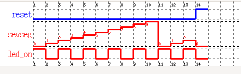
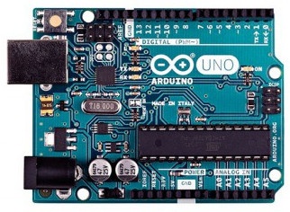
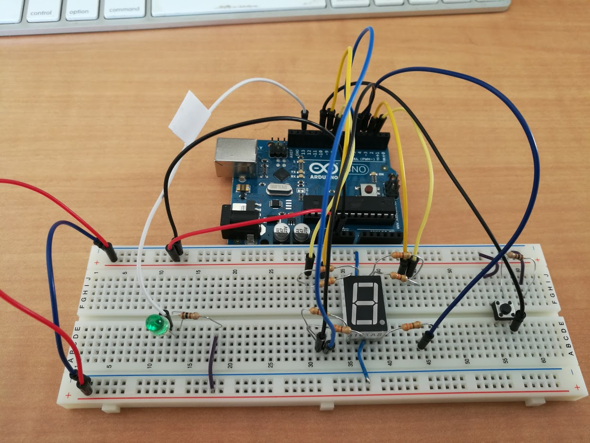
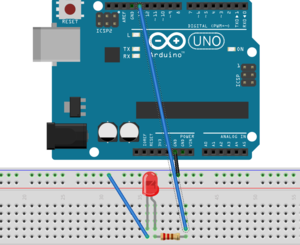
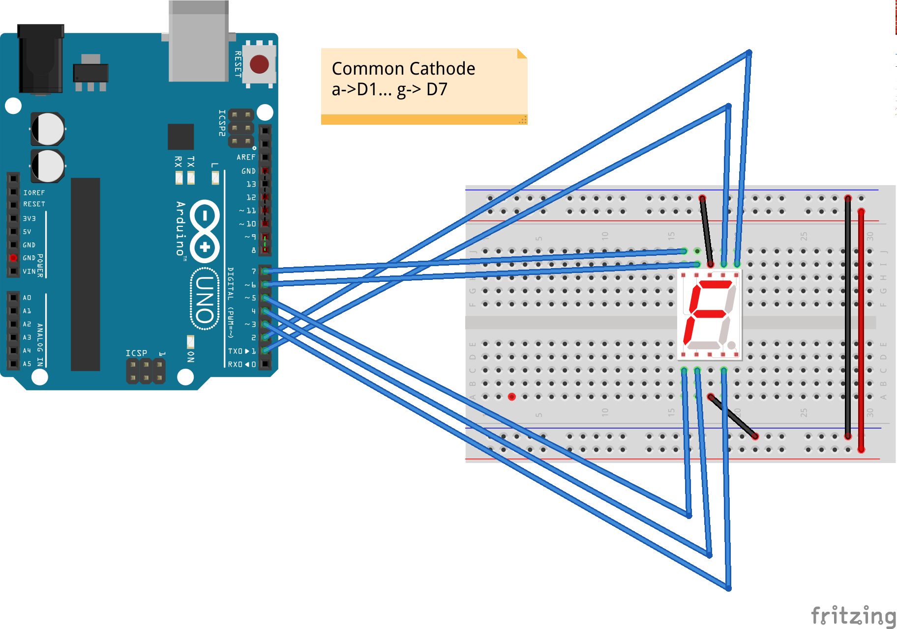
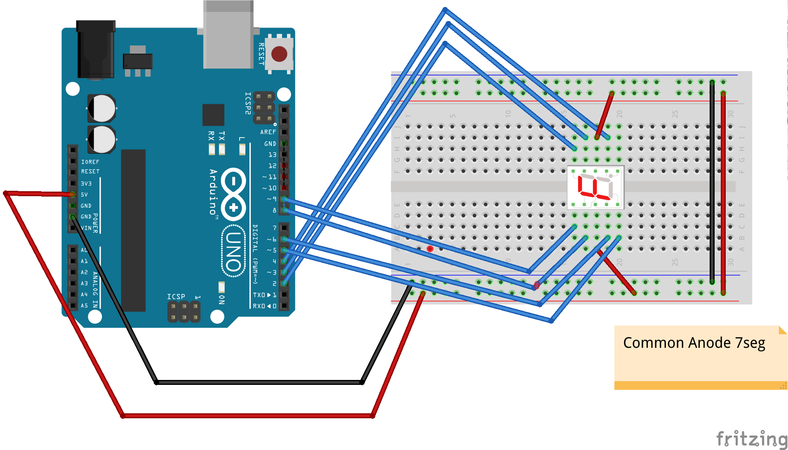
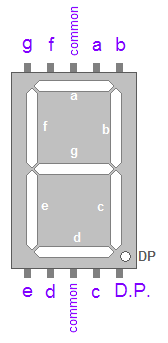
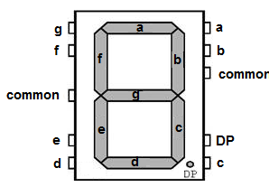

# SEC-Lab 1: ArduinoML

  * M2 IF, ENS Lyon
  * Sébastien Mosser, Université Cote d'Azur, I3S, [email](mailto:mosser@i3s.unice.fr)
  * Laure Gonnord, Université Lyon 1, LIP [email](mailto:laure.gonnord@ens-lyon.fr)
  * Version: 2017.05

## Problem Description

** TODO : change the fig! **

## Domain Description

### Pre-installation (Arduino stuff)

  * You may have to install the following (Linux) packages: `arduino` ,
`gcc-avr` and `avrdude` (`avr-binutils` et `avr-libc` if they are not included)
  * `avrdude.conf` must be in `/usr/share/arduino/hardware/tools/` (if not you have to modify Makefiles).
  * The user should have the right to write on  the USB port : 
`usermod -aG dialout <username>`

### A traduire 

Les cartes Arduino / Guenuino sont des cartes matériellement libres
architecturées autour d'un micro-contrôleur de la famille AVR
d'Atmel. Pour ce TP nous utiliserons des Arduino UNO (atmega328p)
comme celui de la Figure, qui fournissent un certain
nombre d'entrées sorties numériques et analogiques sur lesquelles nous
pourrons connecter des LEDs, des boutons poussoir, un afficheur 7
segment.

Le micro-contrôleur est
programmé avec un bootloader de façon à ce qu'un programmateur
  dédié ne soit pas nécessaire. Les Makefile fournis utiliseront
  `avrdude` [doc](http://www.nongnu.org/avrdude/)
  pour charger les binaires dans la mémoire du  micro-contrôleur.

You will be given a whole platform with an arduino, some leds, a
breadboard, \ldots  **You will be responsible for them for the
duration of the lab**

*  On utilise une plaque d'essai *breadboard* sans
  soudure. Dans cette plaque, 
  tous les points d'une même ligne d'alimentation (horizontales sur le
  schéma) et tous les points d'une même colonne (numérotées 20, 30,
  ... sur le schéma) sont connectés entre eux.

* Led on digital 13 with 220 ohm resistor. (grande pate au digital 13)

* Button on digital 10, and 220 ohm resistor.

* 7 segment : a on digital 1 via resistor 220 ohm, b on digital 2, \ldots
  g on digital 7 .

## Example Applications

### Switch the light on!

### Count to 9

**Warning, the 7 segment displays should be connected though resistors
(from 220 to 400 ohm):**

### The all together

## Steps

In this lab, you will implement the very same (simple) piece of software, at different levels of abstraction. This journey through abstraction levels will help you to identify the pros and cons of each level, and the importance of model-driven engineering and domain-specific languages to reason about domains.

  1. [Plain old C code](https://github.com/mosser/sec-labs/blob/master/lab_1/step_1.md)
  2. [Using the ArduinoLib](https://github.com/mosser/sec-labs/blob/master/lab_1/step_2.md)
  3. [Implemeting a Finite State Machine](https://github.com/mosser/sec-labs/blob/master/lab_1/step_3.md)
  4. [Modelling a Finite state machine](https://github.com/mosser/sec-labs/blob/master/lab_1/step_4.md)
  5. [Using an existing language: Lustre](https://github.com/mosser/sec-labs/blob/master/lab_1/step_5.md)
  6. [Implementing an external compiler](https://github.com/mosser/sec-labs/blob/master/lab_1/step_6.md)
  7. [Embedding inside an host language](https://github.com/mosser/sec-labs/blob/master/lab_1/step_7.md)
  8. [Using a DSL workbench](https://github.com/mosser/sec-labs/blob/master/lab_1/step_8.md)
