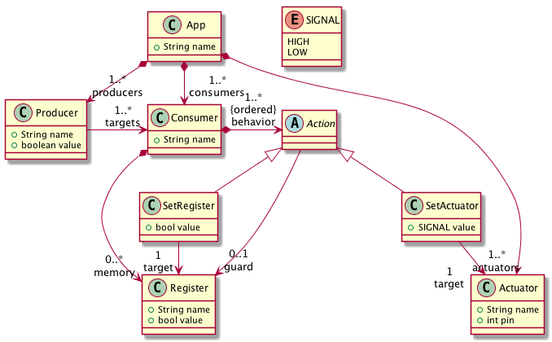
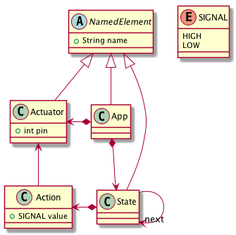

# SEC-Lab1, Step 5

  * M2 IF, ENS Lyon
  * Sébastien Mosser, Université Cote d'Azur, I3S, [email](mailto:mosser@i3s.unice.fr)
  * Laure Gonnord, Université Lyon 1, LIP [email](mailto:laure.gonnord@ens-lyon.fr)
  * Version: 2018.09
  * [Starter code](https://github.com/mosser/sec-labs/tree/master/lab_1/_code/step5)
  * Previous step: [Step #4](https://github.com/mosser/sec-labs/blob/master/lab_1/step_4.md)


## Objectives

  1. Building the right model for the right domain
  2. Explore: 
    - how to change a model-based representation;
    - or how to define a composition operator

The choice is up to you. To tame the limitations identified during the previous step, we offer you two choices. On the one hand you can change your meta-model, and propose one that is more relevant for the domain (we propose here a simplification of a reactive system meta-model). On the other hand, you can stick with the previously defined meta-model, and create a composition operator that will help to design large apps by composing the different FSMs in an automated way.


## Choice #1: Building a Reactive Meta-model


Consider the following meta-model as an example. 

<p align="center">

 

</p>


Provide an object based implementation of this approach, and define a visitor that will yield executable code. To simplify code generation, we can relax the execution semantics and consider the following implementation in C.

Firs, we consider each hardware component as a functional element that has a business value from the application point of view.

```C
boolean led_on = true;
void change_state_led(){
  if (led_on){ digitalWrite(13, LOW); }
  else { digitalWrite(13, HIGH); }
  led_on = !led_on;
}
```

Then, we implement the reaction as a simplified _pub/sub_ mechanism. Producers will set flags for consumers, which will react to such flags when needed.

```C
boolean is_present(int messageQueue) { return messageQueue == 1; }
boolean LED_FLAG   = false;

void button_push() {
  if (digitalRead(10) == HIGH) { LED_FLAG = true; }
}

// ###### Message consumers
void led_pull() {
  // do nothing if no message present
  if(!is_present(LED_FLAG)) { return; }
  change_state_led(); // business code
  LED_FLAG = 0;        // remove flag
}
```


Finally, the `main` loop simply triggers the message producers, then the consumers, then sleep. 

```C
int main(void)
{
  setup();
  while(1) {
    // message producer
    button_push();
    // message consumer
    led_pull();
    // frequency
    _delay_ms(100);
  }
  return 0;
}
```

Please notice that this is an oversimplification at the implementation level. We will see in step 6 how to use a real reactive language. It is also possible to produce way better code at this step, but do not forget that the objective of this course is not advanced code generation but domain modelling.

## Choice #2: Composing two apps

We consider here the meta-model from the previous step (considering its extended version to support the requirements of the lab).


<p align="center">

 

</p>


Instead of changing the meta-model, we can decide to create a tool that will compose two apps together automatically. Applying the _separation of concerns_ (SoC) paradigm, each application is defined separately, and an automatic tool is provided to build the final and complex one. 

In our case it means to define a composition operator `+`, that, given two applications `app1` and `app2` can produce `app' = app1 + app2`. The shared resources (here the button) need to be unified and composed in the final application:

  - `app1`: an application that switch on and off the light when the button is pressed
  - `app2`: the 7-segment counter, reset to 0 when the button is pushed
  - `app'`: the expected app, counting from 0 to 9 and reset to 0 *while* switching the light on and off.

At the code level, it means to implement a binary law of composition, that takes two `App` and produce a new one. A Java skeleton to model and implement such a law is given here:

```Java
public class CompositionLaw extends BinaryLaw<App> {

	@Override 
	public App compose(App left, App right) {
		// ...
	}

}
```


## Documentation & Bibliography

  - [State Machine Composition](http://retis.sssup.it/~marco/files/lesson6-state_machines_connections.pdf)
  - [Reactive Programming _versus_ Reactive system](https://www.oreilly.com/ideas/reactive-programming-vs-reactive-systems)

## Feedback questions

* Compare how this modeling solution and the previous one
match the domain, especially regarding expressiveness and
scalability.

* What is the cost (e.g., modeling, code generation) of a new
feature for the developer?

* What about scalability of the modeling paradigm itself?


* Going to next step: [Step #6](https://github.com/mosser/sec-labs/blob/master/lab_1/step_6.md)
