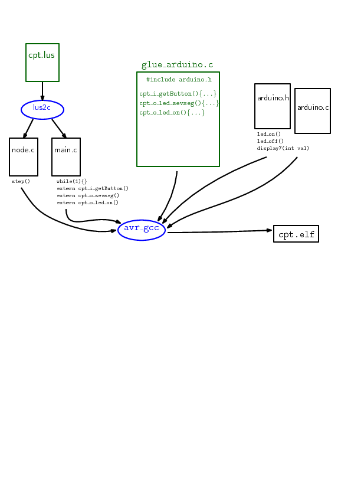

# SEC-Lab1, Step 5

  * M2 IF, ENS Lyon
  * Sébastien Mosser, Université Cote d'Azur, I3S, [email](mailto:mosser@i3s.unice.fr)
  * Laure Gonnord, Université Lyon 1, LIP [email](mailto:laure.gonnord@ens-lyon.fr)
  * Version: 2017.05

  * Previous step: [Step #4](https://github.com/mosser/sec-labs/blob/master/lab_1/step_4.md)


## Objectives

Use the Lustre synchronous language and compiler.


## The LED example


* In Lustre, things are simple, we encode the sequence of values of
boolean or numerical variables into _nodes_. The compilation chain does the rest!

```
node cpt(reset:bool) returns  (led_on: bool) ;
let
   led_on = false -> not(pre(led_on));
tel
```

* Observe the  `glue_arduino.c` and `main.c` files. The main loop is
  still encoded by the user, but the rest of the functionnality: the
  `step()` function is not.

* After compilation, observe the automatically generated `cpt.c`
  file. The Lustre compiler (`lus2c`) has been invoked.


## Documentation & Bibliography

* Have a look into the 
[Lustre official webpage](http://www-verimag.imag.fr/Lustre-V6.html?lang=fr)

**TODO voir ce qui vient avec lustre V6, sinon back to V4**

* Lustre Compilation Flow: 


**TODO modifier le dessin **

* The Lustre compiler comes with some other tools like a simulator, and
 a model checker. If you have time, you can play with them and try to
 prove simple properties.

## Expected Work

* Modify the Lustre code to enable the button (reset is true if the
button has value 1). Compile, test!

* Modify the Lustre code (and perhaps other files) for the seven
segment display. Compile, test!


 * Going to next step: [Step #6](https://github.com/mosser/sec-labs/blob/master/lab_1/step_6.md)
