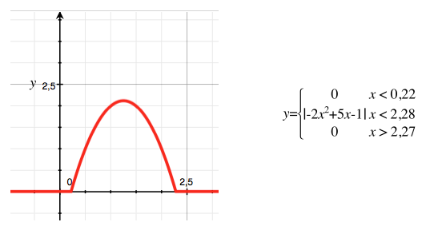
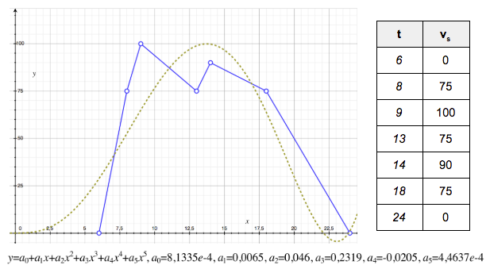
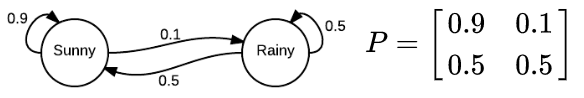

# Sensor Simulation Lab

  * Author: Sébastien Mosser
  * Reviewer: Laure Gonnord
  * Revision: 18.10


## Project Rationale

The Gartner group’s forecasts predict up to 26 billions of things that could be connected to the Internet by 2020 forming the Internet of Things (IoT). Once measured, data gathered from IoT sensors are key enablers for next generation infrastructures such as Smart Cities or Smart Grid. In sensing infrastructures [1], sensor networks are responsible for measuring physical phenomena and sending values to a remote IoT middleware where the collected data can be retrieved by third-party applications. In addition, such middleware is also responsible for managing the devices deployed in the sensor networks [2].

Developing a middleware dedicated to sensor networks is a non-trivial task. Testing the system in real condition does not make sense, as one should be able to work without being connected to the 12,345 sensors deployed in a Smart City (or a Smart Campus [3]). But the test infrastructure must be as close to the real system as possible. It is then necessary to simulate the sensor network in a proper way.

Sensor data can be simulated in different ways. On the one hand, the simplest way is to “replay” an existing dataset. However, one need to acquire such a dataset to be able to play it. On the other hand, it is possible to generate these data based on a law associated to the sensor. For example, considering a given set of reference points for a given sensor, one can interpolate an associated function using polynomial interpolation. This function can then be used to generate sensor data at any time. One can also rely on classical Markov chain to model a sensor behavior and then obtain sensor values [4]. Considering these different way to model sensors, one should then be able to replicate a sensor model and start a testbed. Finally, a simulation context can be defined by instantiating multiple sensors class in different contexts, and started in parallel on one or more physical machine to simulate the modelled sensors. A context can be used to generate dataset as static files, or to dynamically simulate sensors and push the data to a collector like real sensors.


## Sensor Measurement Backend

A sensor measurement is defined as a tuple (t,s,v), where t is the time where the value v was recorded for the sensor s. Some standards are built on top of this atomic definition, such as [SenML](https://tools.ietf.org/html/draft-ietf-core-senml-12 ) for example. 

We propose to use the following technological stack to support the simulated data collection and display: 

  1. InfluxDb for data collection, 
  2. Grafana for dashboard definition and
  3. Docker to support en easy deployment.

See the [backend technical description](./backend/README.md) for more details.


## Replaying Existing Measurements


### Identifying Data sources

Sensor measurement that were already collected can be stored in various locations, and at different places, e.g., CSV files, JSON documents, SQL server, Excel files, InfluxDB time series. The system must be able to express things such as “define a sensor that mimics the contents of the CSV file located at the following URL, where the first column is t, the third one is v and the fifth one is s”. Examples can be found on the [SensApp collection middleware](https://github.com/SINTEF-9012/sensapp/tree/master/net.modelbased.sensapp.data.samples) repository

### Tailoring measurements

Consider Alice, a software engineer who wants to reuse an existing datasource in her simulation. She can shift the measurement timestamps by a given offset, for example to replicate today a set of measurements collected last year. She can also introduce some noise on the data (e.g., a random value to be added to the legacy measurement randomly taken within a given range).

## Modelling Sensor Laws

For simulation purpose, one must be able to model a law associated to a given sensor. The most basic law is the random one, used to simulate a random sensor. Using the previously defined technological stack, it is easy to create a shell script that pushes random data to a given database:

```bash
#!/bin/bash
while :;
do
	VALUE=$RANDOM;
	STAMP=`date +%s000000000`;
	echo "sensor: $VALUE @$STAMP";
	curl -i -XPOST 'http://localhost:8086/write?db=my_database' \
        	 --data-binary "a_given_sensor value=$VALUE $STAMP";
	T=$(( ( RANDOM % 10 )  + 1 ));
	sleep $T;
done
```

### Modelling functions

One can model a sensor _s_ as a mathematical function that returns a value within the sensor domain (integer, booleans, string) based on the given time: _v = f\_s(t)_. 

For example, the following law is obtained using the function depicted on the right hand side of its representation (_y_ is the sensor value, and _x_ the time of measurement).


<div align="center">



</div>


### Interpolating polynomial functions

If the polynomial function is not known, one can use linear interpolation to compute the function based on remarkable points. For example, in Fig 3, we specified the points that covers the capacity of a given parking lot in the campus: empty by night, full around 9, with a down peak at lunch and a slow decrease in the afternoon. It is important to leverage the data set and the interpolated function to identify the error associated to the interpolation (here quite strong, even generating a negative capacity).


<div align="center">



</div>


### Modelling Markov Chains


A Markov chain is a model that represents states (here sensor value) and the probability to go from one state to another. for example, in Fig 4, we describe a markov chain for a weather sensor that outputs value in _{Sunny, Rainy}_. The chain can be described as a graph (_i.e._, with states and transitions), or through its transition matrix. The model must be verified, _i.e._, the outgoing probabilities of a given state must be equals to one.


<div align="center">



</div>

## Defining Simulations

Using the previously defined laws, one can declare sensor lots, for example to model a given parking lot through the instantiation of 75 instances of a “parking slot sensor” law that models an individual slot in a given parking. Or model a set of classrooms that contains occupancy and temperature sensors. The whole campus is modelled based on the aggregation of such zones. Each law can be configured, like the replays, by specifying an offset, or for example for the markov chain by specifying an execution frequency.

Then, the simulation can be executed, and the generated values sent to the collection backend. Considering that a simulation can be quite long and have a side effect on the collection back-end, one must be able to verify that the simulation is correct (good laws, good composition) before running it.


## Extensions

You have to select and implement one of the following extensions, to be included in your language.


### E1: Noise, Chaos Monkeys & Chaos Gorilla

The noise described in the replay section is quite simple. The DSL must support the application of much clever noise (e.g., cumulative, time-dependent). In addition, sensors are fragile pieces of hardware, so a chaos monkey can be used to randomly stop some sensors (definitively or temporarily). To simulate a global network failure, a chaos gorilla can knockdown complete zone during simulations.

### E2: Visualisation Dashboards

The DSL can support the way the user wants to display the produced datasets. It must express the different views to be created in Grafana, and automatically create the associated artefacts.

### E3: Composite Sensors

In addition to the laws, one might create composite sensors by aggregating values from others in a given simulation. For example, considering a parking lot made of individual sensors, the load of the parking can me modelled as the sum of all individual values a the very same time.

### E4: Real Time Simulations

Until now, the simulation generate time-stamped data, but do not require the simulation to behave like real sensors. The measurements can be generated on the fly, and sent like the simulated sensor will behave in reality. 

### E5: Software Product Lines

Sensor laws should be classified according to different criteria (technical, business). Then, the user might simply configure a simulation by selecting sensors according to these criterias. Based on these choices, the real simulation code is then generated and executable,

### E6: Sensor Law Compositions

One should be able to create a law by assembling others, e.g., by combining to markov chains, by using a function inside a given state of a markov chain, by mathematically compose two laws (e.g., average, max, min).

### E7: Ensuring Simulation Quality

The DSL must support a way to assess the quality of the simulation. For example, missing values in a relay can be ignored, or averaged. For sensors linked to laws, a validity range can be used to define upper and lower bounds (a parking capacity cannot be negative).


## Expected Work

  1. Choose a class of domain specific language (embedded or external) and an associated technology;
  2. Implement a DSL that fits the problem described in this document, including:
    - At least two different ways to support datasets replay,
    - At least two different way to model a law (plus the random one as MVP),
    - One of the listed extension;
  3. Implement several sensor laws using your language to demonstrate your expressiveness (at least two per kind);
  4. Implement  several simulations that uses your laws and replays in a clever way and push the simulated output to the given backend;
  5. Describe your language in a report (PDF, 11pts, 10 pages max), that represents:
    - The domain model represented as a class diagram;
    - The concrete syntax used to model replays, laws and simulation;
    - A description of your extension and how it was implemented;
    - The critical analysis of your choices (language class + internal choices) with respect to the domain;
    - A discussion about DSLs in general in the context of SSL.

## References


  1. A. H. Ngu, M. Gutierrez, V. Metsis, S. Nepal, Q. Z. Sheng, Iot middleware: A survey on issues and enabling technologies, IEEE Internet of Things Journal 4 (2017) 1–20.
  2. S. Bandyopadhyay, M. Sengupta, S. Maiti, S. Dutta, A survey of middleware for internet of things, in: Recent Trends in Wireless and Mobile Networks, Springer, 2011, pp. 288–296.
  3. Cyril Cecchinel, Matthieu Jimenez, Sébastien Mosser, Michel Riveill. “An Architecture to Support the Collection of Big Data in the Internet of Things” in Proceedings of the International Workshop on Ubiquitous Mobile cloud (UMC'14, co-located with SERVICES), IEEE, pages 1-8, Anchorage, Alaska, USA, 27-2 june 2014
  4. "Predicting Parking Lot Occupancy in Vehicular Ad Hoc Networks" by Murat Caliskan, Andreas Barthels, Bjorn Scheuermann and Martin Mauve. 65th IEEE Vehicular Technology Conference, Dublin, Ireland, April 2007.

