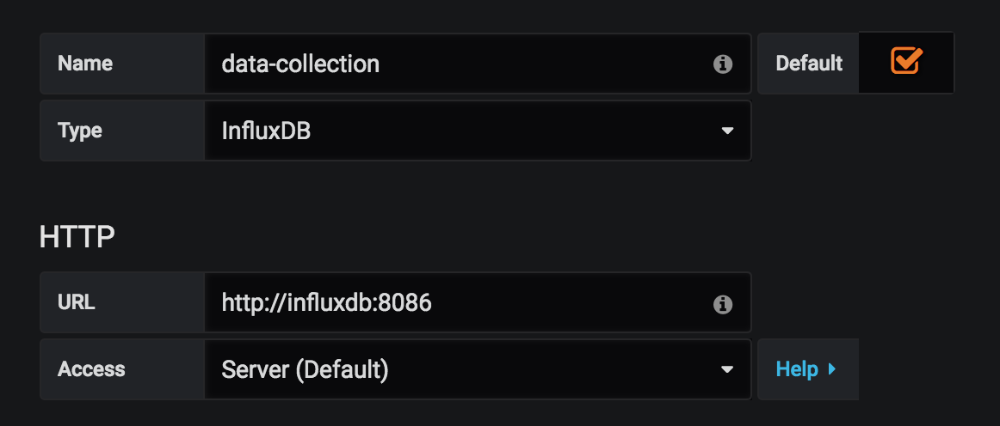
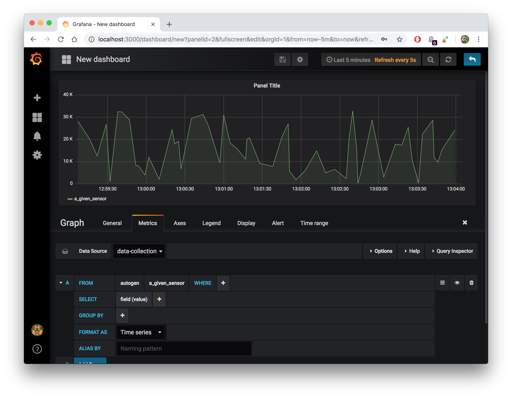

# Data Sensor Simulation Backend

  * author: Sebastien Mosser
  * version: 17.10
  * Based on [https://github.com/nicolargo/docker-influxdb-grafana/](https://github.com/nicolargo/docker-influxdb-grafana/) & discussions with Romain Rouvoy


## Backend definition

### Technological Stack
  
We use InfluxDB to collect the data, Grafana to display dashboards, and Docker to assemble the two previous tools. Docker relies on _images_ (see it like light virtual machines), deployed inside _containers_. An image is a turn-key artefact containing a ready to start instance of the packaged software.

 When multiple containers must be deployed at the very same time to implement a complete system, a `docker-compose.yml` descriptor is defined to describe such an assembly. In our case (long story short) this descriptor:

  1. create a container named `sec-influxdb`, bound to the latest InfluxDB image, and exposing port 8086. It stores data on the host inside the `./influxdb-data` directory;
  2. Create a container named `sec-grafana`, bound to the latest Grafana image and exposing port 3000. It stores data on the host inside the `./grafana-data` directory

```docker
influxdb:
  image: influxdb:latest
  container_name: sec-influxdb
  ports:
    - "8086:8086"
  volumes:
    - ./influxdb-data:/var/lib/influxdb

grafana:
  image: grafana/grafana:latest
  container_name: sec-grafana
  ports:
    - "3000:3000"
  volumes:
    - ./grafana-data:/var/lib/grafana
```   
  
### Running the backend

First things first, you need to install docker _Community Edition_:

  - On a Mac: [https://store.docker.com/editions/community/docker-ce-desktop-mac](https://store.docker.com/editions/community/docker-ce-desktop-mac)
  - On windows 10: [https://store.docker.com/editions/community/docker-ce-desktop-windows](https://store.docker.com/editions/community/docker-ce-desktop-windows)
  - On Linux, e.g., Ubuntu: 
    - sudo apt-get update
    - sudo apt-get install docker-ce  docker-compose
    - sudo service docker start
    - _customise the groups to add you user in the docker group, or start the lab using sudo._


To start the data collection back-end, we simply starts the composition of containers:

```
$ cd lab_2/backend
$ docker-compose up -d
```

To stop it:

```
$ docker-compose down
```

To clear the data contents, simply delete the contents of the `influxdb-data` directory. 

## Interacting with InfluxDB

InfluxDB is a time-serie database, designed to store measurements. We interact with the backend using an HTTP API published by the InfluxDB engine on port 8086. 

To create a database named `sec`:

```
$ curl -i -XPOST http://localhost:8086/query --data-urlencode "q=CREATE DATABASE sec"
```

### Pushing measurements

To send a measurement of `0,64` to the backend for a sensor named `a_given_sensor`, measured at timestamp `1507233041000000000`, we use the following call:

```
curl -i -XPOST 'http://localhost:8086/write?db=sec' --data-binary 'a_given_sensor value=0.64'
```

### A very simple sensor bot

The following shell script push a random value to a given sensor, and sleep for 1 to 10 seconds before pushing the next value.

```bash
while :; do VALUE=$RANDOM; STAMP=`date +%s000000000`; echo "sensor: $VALUE @$STAMP"; curl -i -XPOST 'http://localhost:8086/write?db=sec' --data-binary "a_given_sensor value=$VALUE $STAMP"; T=$(( ( RANDOM % 10 )  + 1 )); echo sleep $T; sleep $T; done
```

### Retrieving data


```
$ curl -G 'http://localhost:8086/query?pretty=true' --data-urlencode "db=sec" --data-urlencode "q=SELECT \"value\" FROM \"a_given_sensor\""
```

## Creating interactive dashboards

Grafana is a dashboard engine, used to connect to the InfluxDB and display the stored time series. The engine is exposed on port 3000, and use the `admin/admin` credentials by default.

  * [http://localhost:3000](http://localhost:3000)

### Create a data source

We need to link Grafana to InfluxDB. The data source is named `data-collection`, using the `InfluxDB` driver. We will connect to the `influxdb` container on port `8086`, using the classical client-server mode. Do not forget, before clicking the `Save & Test` button, to specify in the _InfluxkDB Details_ / _Database_ field the  name of the newly created database (_i.e._, `sec`).

<div align="center">


  
</div>

### Creating a Dashboard

Select Dashboards, the New in the Grafana menu (top-left icon). Add a Grah in the empty space. Click on the title to get a contextual menu, and select Edit. The Metrics configuration panel allows one to configure which time series to display (_i.e., an InfluxDB query) using this widget.

<div align="center">


  
</div>


